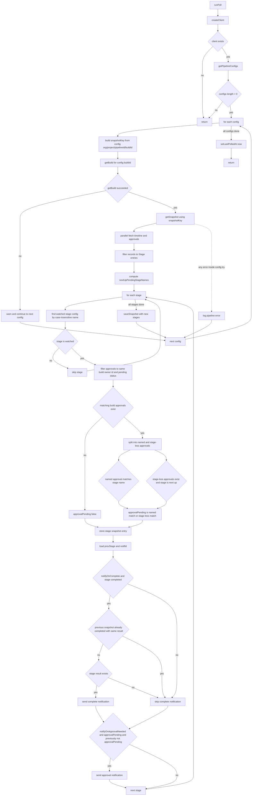
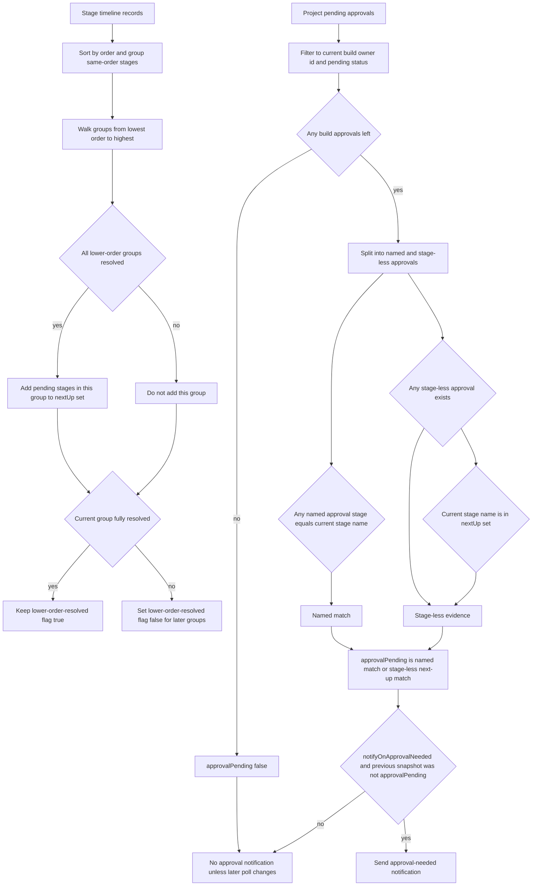

# `src/background/poller.ts` logic walkthrough

## What `runPoll()` does

`runPoll()` is the background service worker's polling pass. On each run, it:

1. Creates an Azure DevOps client from stored credentials.
2. Loads the saved pipeline-monitoring configs.
3. For each monitored pipeline/build, fetches the current build, its timeline, and the project's pending approvals.
4. Decides whether any watched stages have newly completed or newly started waiting for approval.
5. Sends notifications only for newly detected transitions.
6. Saves a fresh snapshot for the next diff.
7. Updates the `last_polled_at` timestamp.

### When it is invoked

`src/background/service-worker.ts` wires it up in four places:

- `chrome.runtime.onInstalled`: recreates the alarm, then immediately calls `runPoll()`.
- `chrome.runtime.onStartup`: ensures the alarm exists.
- `chrome.alarms.onAlarm`: calls `runPoll()` when the `devops-poll` alarm fires.
- `chrome.runtime.onMessage` with `type === 'FORCE_POLL'`: manual immediate poll from the UI.

The recurring alarm period is `0.5` minutes (30 seconds).

## Supporting pieces it relies on

### ADO types used by the poller

- `AdoBuild`: the specific build run being monitored. Important fields here are:
  - `id`: the build/run ID.
  - `definition.id` / `definition.name`: the pipeline definition identity.
  - `status` and `result`: overall build state.
- `AdoTimelineRecord`: one entry from the build timeline. The poller only cares about records where `type === 'Stage'`, then reads:
  - `name`
  - `state`
  - `result`
  - `order`
- `AdoApproval`: one pending approval returned by the approvals API. The important fields are:
  - `status`
  - `pipeline.owner.id`: the gated build/run ID
  - optional `stage?.name`
- `StageConfig`: one watched stage from user config:
  - `stageName`
  - `notifyOnComplete`
  - `notifyOnApprovalNeeded`
- `PipelineConfig`: one monitored pipeline/build:
  - `org`
  - `project`
  - `pipelineId`
  - `buildId`
  - `pipelineName`
  - `stages`
- `StageSnapshot`: what the poller remembers per stage between runs:
  - `state`
  - `result`
  - `approvalPending`
- `BuildSnapshot`: one saved snapshot for a monitored build, keyed by:
  - `org`
  - `project`
  - `pipelineId`
  - `buildId`
  - plus `stages`

### Snapshot storage

`src/background/state.ts` is the poller's persistence layer:

- `getSnapshot(key)`: loads the prior `BuildSnapshot` for the exact monitored build.
- `saveSnapshot(snapshot)`: upserts the latest `BuildSnapshot`.

This snapshot is what prevents duplicate notifications across repeated polls.

### Notifications

`src/background/notifier.ts` exposes `sendNotification(...)`.

The poller does not build Chrome notification objects directly. Instead it calls `sendNotification`, which:

1. Builds the Azure DevOps build URL.
2. Stores `notification id -> build URL` in `chrome.storage.local`.
3. Creates the Chrome notification.

That stored mapping is what lets the service worker open the correct build page on notification click.

## Full execution order of `runPoll()`

This section follows the real code path top-to-bottom.

### 1. Create the ADO client, or exit immediately

```ts
const client = await createClient();
if (!client) return;
```

`createClient()` reads stored credentials. If credentials are missing, it returns `null`, and `runPoll()` exits without doing anything else.

So the very first gate is: **no credentials, no polling**.

### 2. Load monitored pipeline configs, or exit immediately

```ts
const configs = await getPipelineConfigs();
if (configs.length === 0) return;
```

If there are no saved monitoring configs, the poller also stops immediately.

So the second gate is: **no monitored pipelines, no polling**.

### 3. Iterate one config at a time, with per-config error isolation

```ts
for (const config of configs) {
  try {
    ...
  } catch (err) {
    console.error(...);
  }
}
```

Each pipeline config is processed inside its own `try/catch`.

That means:

- one broken pipeline/config/API response can fail,
- its error is logged,
- but the rest of the monitored pipelines still continue polling.

This is important: **a single pipeline failure does not abort the whole poll cycle**.

### 4. Resolve the monitored build

Inside the loop, the poller builds the exact monitoring key from the already-normalized config:

```ts
const snapshotKey = {
  org: config.org,
  project: config.project,
  pipelineId: config.pipelineId,
  buildId: config.buildId,
};
```

`getPipelineConfigs()` has already normalized and filtered persisted configs before the poller sees them, so `config.buildId` is always the pinned build ID for this monitored item.

The poller then fetches that exact build:

```ts
build = await getBuild(client, config.project, config.buildId);
```

That fetch is wrapped in an inner `try/catch`:

```ts
try {
  build = await getBuild(...);
} catch (err) {
  console.warn(...);
  continue;
}
```

If the pinned build fetch fails:

- the poller logs a warning,
- skips the rest of this config with `continue`,
- and moves on to the next monitored pipeline.

It does **not** clear or overwrite the old snapshot in this case.

### 5. Load the previous snapshot for diffing

```ts
const snapshot = await getSnapshot(snapshotKey);
```

This loads the previously saved `BuildSnapshot` for the exact `(org, project, pipelineId, buildId)` combination.

The snapshot is later used for two separate duplicate-suppression checks:

- "was this stage already completed with this same result?"
- "was this stage already marked as approval-pending?"

### 6. Fetch timeline and approvals in parallel

```ts
const [records, approvals] = await Promise.all([
  getTimeline(client, config.project, build.id),
  getPendingApprovals(client, config.project),
]);
```

The poller fetches both dependencies at the same time:

- the current build's timeline
- the project's pending approvals

This is a latency optimization only; both results are still needed before decisions are made.

Important behavior detail:

- `getTimeline(...)` is build-specific.
- `getPendingApprovals(...)` is project-wide, so later code must filter approvals back down to the current build.

Also note that `getPendingApprovals(...)` itself already degrades to `[]` if the approvals endpoint fails, so `runPoll()` keeps going in that case.

### 7. Keep only stage timeline records

```ts
const stages = records.filter(r => r.type === 'Stage');
```

Timeline payloads can contain phases, jobs, tasks, etc. The poller discards all of those and only keeps actual stage records.

Everything from this point onward works only on `type === 'Stage'`.

### 8. Prepare new snapshot state and compute "next up" pending stages

```ts
const newStages: Record<string, StageSnapshot> = {};
const nextUpPendingStageNames = getNextUpPendingStageNames(stages);
```

`newStages` will become the newly saved snapshot.

`getNextUpPendingStageNames(...)` is the helper that makes stage-less approvals safe to attribute.

## How `getNextUpPendingStageNames()` works

This helper returns a `Set<string>` of lowercase stage names that count as "next up".

### Step A: `isStageResolved()`

The helper depends on:

```ts
function isStageResolved(stage: AdoTimelineRecord): boolean {
  return stage.state === 'completed' || stage.result === 'skipped';
}
```

A stage is treated as resolved if either:

- its `state` is `completed`, or
- its `result` is `skipped`

That means a skipped stage still counts as no longer blocking later stages.

### Step B: group stages by `order`

The helper first sorts all stages by ascending `order`, then groups them into:

```ts
Map<number, AdoTimelineRecord[]>
```

So if two stages both have `order = 2`, they end up in the same group.

This matters because same-order stages are treated as parallel siblings.

### Step C: walk order groups from lowest to highest

It keeps a boolean:

```ts
let allLowerOrderStagesResolved = true;
```

Then for each order group:

1. If **all strictly lower-order groups** are resolved, every `pending` stage in the current group is added to the set.
2. After that, if **any** stage in the current group is not resolved, the flag flips to `false` and stays false for all later groups.

So the helper's rule is:

> A pending stage is "next up" only if every stage at lower order has already completed or been skipped.

### Concrete example with parallel stages

Example timeline:

| Stage | Order | State | Result |
|---|---:|---|---|
| Smoke | 1 | completed | skipped |
| Deploy West | 2 | pending |  |
| Deploy East | 2 | pending |  |
| Prod | 3 | pending |  |

Walkthrough:

1. Order `1`: `Smoke` is resolved because its result is `skipped`.
2. Order `2`: all lower orders are resolved, so both pending siblings qualify:
   - `deploy west`
   - `deploy east`
3. Order `2` is not fully resolved yet, because both stages are still pending, so `allLowerOrderStagesResolved` becomes `false`.
4. Order `3`: `Prod` does **not** qualify, even though it is pending, because lower-order stage group `2` is still unresolved.

Result:

```ts
Set { 'deploy west', 'deploy east' }
```

That is why a stage-less approval can be mapped to multiple same-order siblings, but not to later downstream stages.

## Back to `runPoll()`: per-stage processing

After computing `nextUpPendingStageNames`, the poller logs a summary and processes each stage:

```ts
for (const stage of stages) {
  ...
}
```

### 9. Find the matching watched stage config, or skip the stage

```ts
const stageConfig = config.stages.find(
  s => s.stageName.toLowerCase() === stage.name.toLowerCase()
);
if (!stageConfig) continue;
```

This lookup is case-insensitive.

If the current timeline stage is not one of the user-configured watched stages, the poller skips it entirely:

- no approval logic,
- no completion logic,
- no notification,
- no snapshot entry for that stage.

Unwatched stages still mattered earlier for `getNextUpPendingStageNames(...)`, because they can block later stages, but they are not themselves tracked or notified.

### 10. Compute `approvalPending`

The code starts pessimistically:

```ts
let approvalPending = false;
```

Then it filters the project-wide approvals down to this build run:

```ts
const buildApprovals = approvals.filter(
  a => a.pipeline.owner.id === build!.id && a.status === 'pending'
);
```

This filter is critical:

- `a.status === 'pending'`: only active approvals matter.
- `a.pipeline.owner.id === build.id`: only approvals for the current build run matter.

This is why the code does **not** use `pipeline.id` here:

- `pipeline.id` is the pipeline definition ID as a string.
- `pipeline.owner.id` is the specific build/run ID.

The poller needs the run-level ID.

If there are no matching build approvals, `approvalPending` stays `false`.

### 11. Split approvals into named vs stage-less

When there are matching build approvals:

```ts
const stageName = stage.name.toLowerCase();
const namedApprovals = buildApprovals.filter(a => a.stage?.name);
const stagelessApprovals = buildApprovals.filter(a => !a.stage?.name);
```

This creates two evidence categories.

#### Named approval match

```ts
const matchesNamedApproval = namedApprovals.some(
  a => a.stage!.name.toLowerCase() === stageName
);
```

If an approval explicitly names a stage, the match must be exact, case-insensitive, against the current timeline stage name.

This is the strongest signal.

#### Stage-less approval match

```ts
const matchesStagelessApproval =
  stagelessApprovals.length > 0 && nextUpPendingStageNames.has(stageName);
```

If approvals exist for the build but do **not** name a stage, the poller only attributes them to stages that are in the computed "next up" set.

So stage-less approvals are **not** broadcast to every pending stage in the build. They are narrowed to:

- this build run,
- current approval status `pending`,
- stages that are pending now,
- and whose lower-order predecessors are all resolved.

#### Final approval decision

```ts
approvalPending = matchesNamedApproval || matchesStagelessApproval;
```

So a stage becomes approval-pending if either:

- a named approval explicitly points at it, or
- there is at least one stage-less approval for this build and the stage is "next up".

### 12. Why the old timeline fallback is gone

The current code intentionally does **not** treat this as enough:

```ts
stage.state === 'pending'
```

That old style of heuristic caused the false-positive bug this area was recently fixed for.

In Azure DevOps timelines, a stage can sit at `state: 'pending'` simply because:

- an earlier stage is still running, or
- the stage has not started yet,

not because a human approval is blocking it.

So the current code requires actual approval evidence from the approvals API. If the API yields no matching approvals, `approvalPending` remains `false`, even if the timeline stage is pending.

That is the deliberate tradeoff that avoids false-positive approval notifications.

### 13. Save current stage state into the new snapshot

```ts
newStages[stage.name] = {
  state: stage.state,
  result: stage.result,
  approvalPending,
};
```

The snapshot stores the raw stage name as the object key, plus:

- current state
- current result
- whether approval was considered pending on this poll

### 14. Load the previous stage snapshot and notification ID

```ts
const prevStage = snapshot?.stages?.[stage.name];
const notifId = `${config.pipelineId}-${build.id}-${stage.name}`;
```

`prevStage` is the prior remembered state for this exact stage name.

`notifId` is the shared base ID used to derive:

- `${notifId}-complete`
- `${notifId}-approval`

### 15. Completion notification path

The completion logic is:

```ts
if (stageConfig.notifyOnComplete && stage.state === 'completed') {
  const prevCompleted =
    prevStage?.state === 'completed' && prevStage?.result === stage.result;

  if (!prevCompleted && stage.result) {
    ...
    await sendNotification(...);
  }
}
```

This means a completion notification requires **all** of the following:

1. The stage is configured with `notifyOnComplete`.
2. The current timeline says `stage.state === 'completed'`.
3. The previous snapshot did **not** already have the same completed state/result pair.
4. `stage.result` is present.

That `prevCompleted` diff is what suppresses duplicates across repeated polls.

Examples:

- Completed `succeeded` now, was previously `inProgress` -> notify.
- Completed `failed` now, was previously `completed/succeeded` -> notify again, because result changed.
- Completed `succeeded` now, was previously `completed/succeeded` -> do not notify again.

The icon is chosen by result:

- `succeeded` -> `✅`
- `failed` -> `❌`
- anything else completed -> `⚠️`

### 16. Approval-needed notification path

The approval notification logic is:

```ts
if (stageConfig.notifyOnApprovalNeeded && approvalPending && !prevStage?.approvalPending) {
  await sendNotification(...);
}
```

This means an approval-needed notification requires **all** of the following:

1. The stage is configured with `notifyOnApprovalNeeded`.
2. The current poll computed `approvalPending === true`.
3. The previous snapshot was not already approval-pending.

That last guard:

```ts
!prevStage?.approvalPending
```

is the duplicate-suppression rule. It only notifies on the transition from:

- previously false / missing
- to currently true

Repeated polls with the same active approval do not re-notify.

### 17. After all watched stages, save the new snapshot

Once the per-stage loop finishes, the poller builds and saves:

```ts
const newSnapshot: BuildSnapshot = {
  org: snapshotKey.org,
  project: snapshotKey.project,
  pipelineId: snapshotKey.pipelineId,
  buildId: snapshotKey.buildId,
  stages: newStages,
};
await saveSnapshot(newSnapshot);
```

This snapshot replaces or inserts the current remembered state for that monitored build.

It is saved even if no notifications were sent, because the snapshot is the poller's memory for the next run.

### 18. If this pipeline/config throws, log and continue

If any unhandled error happens anywhere inside the per-config `try`, the catch logs:

```ts
console.error(`[DevOps Notifier] Poll failed for pipeline ${config.pipelineId}:`, err);
```

Then the outer `for` loop simply proceeds to the next config.

Again: **one pipeline failing does not block the others**.

### 19. After the whole config loop, stamp `last_polled_at`

Finally:

```ts
await setLastPolledAt(Date.now());
```

This happens once, after all configs have been processed.

So the code records the end of the poll cycle, not a per-pipeline timestamp.

## Mermaid flowchart: overall `runPoll()` control flow



## Mermaid flowchart: approval-detection sub-logic



## Known limitations and accepted tradeoffs

- **Approval notifications now depend entirely on the approvals API.** If `/_apis/pipelines/approvals` is unavailable, errors, or returns no matching approvals, the poller will not infer approval-needed from timeline `pending` state alone. This is by design to avoid the false-positive bug where a not-yet-started stage looked like it was waiting for human approval.
- **Approvals are fetched project-wide, then filtered locally to the current build.** That is simple and correct for the current implementation, but it means each poll downloads pending approvals that may belong to other builds in the same project.
- **Only watched stages are snapshotted.** Unwatched stages still influence "next up" computation, but they are not stored in `BuildSnapshot`, so only watched stages participate in duplicate-notification suppression.
- **Stage snapshot keys use the raw timeline stage name.** Config matching is case-insensitive, but the saved snapshot object key is the original `stage.name`, so a future rename or casing change would be treated as a different snapshot entry.
